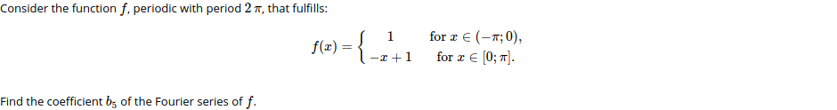
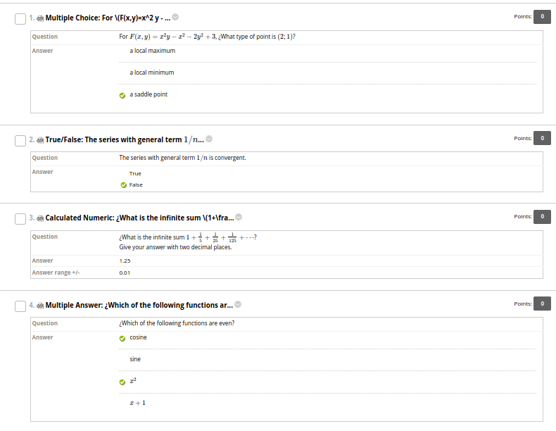
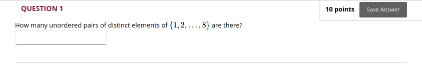

# BBLearnTools

Tools in Python for writing math and quizzes for Blackboard Learn.

[Blackboard Learn](https://www.blackboard.com/teaching-learning/learning-management/blackboard-learn) is a widespread commercial LMS (Learning Management System).

*BBLearnTools* is not affiliated with or endorsed by Blackboard Inc. *BBLearnTools* is made available under the terms of the MIT License.

### Modules in BBLearnTools:

* [blackjax](#module-blackjax): for rendering math in Blackboard with Mathjax2.
* [bbtextquiz](#module-bbtxtquiz): for writing pools of questions in text files, that can be uploaded to Blackboard.


## Module *blackjax*

LaTeX syntax for math content can be used in Blackboard's text editor. This LaTeX code is interpreted by [WIRIS](https://docs.wiris.com/en/mathtype/mathtype_web/latex-support) and rendered with images. The result is not always satisfying. A not very-known alternative is to call locally [Mathjax2](https://docs.mathjax.org/en/v2.7-latest/start.html), instead of the default WIRIS, to render math content. 

*Blackjax* provides tools to convert text written outside of Blackboard Learn, into text whose math can sucessfully be rendered by Mathjax2 within Blackboard Learn (in most Blakboard tools, but not all of them; not, for instance, in discussion boards).

### Example:

In Python, load *blackjaxify*:
```python
from blackjax import blackjaxify
```

and define

```python
s = r'''Consider the function $f$, periodic with period $2 \, \pi$,
that fulfills:
<br>
$$f(x) = \left\lbrace
\begin{matrix}
1 &  \text{ for } x \in (-\pi;0),\\
-x + 1  & \text{ for } x \in [0;\pi].
\end{matrix}
\right.$$
<br>
Find the coefficient $b_5$ of the Fourier series of $f$.'''
```
Then
```python
print(blackjaxify(s))
```
gives:
```html
<script type='text/javascript' async src='https://cdn.jsdelivr.net/npm/mathjax@2/MathJax.js?config=TeX-AMS_CHTML'></script>
Consider the function \(f\), periodic with period \(2&nbsp;\,&nbsp;\pi\),
that fulfills:
<br>
\begin{equation}f(x)&nbsp;=&nbsp;\left\lbrace&nbsp;\begin{matrix}&nbsp;1&nbsp;&&nbsp;&nbsp;\text{&nbsp;for&nbsp;}&nbsp;x&nbsp;\in&nbsp;(-\pi;0),\\&nbsp;-x&nbsp;+&nbsp;1&nbsp;&nbsp;&&nbsp;\text{&nbsp;for&nbsp;}&nbsp;x&nbsp;\in&nbsp;[0;\pi].&nbsp;\end{matrix}&nbsp;\right.\end{equation}
<br>
Find the coefficient \(b_5\) of the Fourier series of \(f\).
```
This string can now be copied & pasted in blackboard's editor (in the [source code window](https://help.blackboard.com/Learn/Instructor/Course_Content/Create_Content/Create_Course_Materials/Work_With_Text/What_Does_the_Editor_Do)) or used in pools of questions that can be [uploaded as text files](https://help.blackboard.com/Learn/Instructor/Tests_Pools_Surveys/Reuse_Questions/Upload_Questions) (Note that in this case, all newline characters should be erased).

This is now rendered in Blackboard as:



### Steps

* write your text. Use LaTeX syntaxis for math, delimited with `$`...`$` or `(`...`)` for inline math, and `$$`...`$$`, `\[`...`]`, `\begin{equation}`...`\end{eqution}`, `\begin{align}`...`\end{align}`for display math. Use HTML tags for formatting text, in particular `<br>` for newlines (the ordinary newline chars won't be kept).

* In python, save your text in a string and apply `blackjaxify`.

### Caveat

Calling Mathjax depends on the availability and accessibility of the Mathjax CDN services.

### References

See the [wiki](wiki).

## Module *bbtextquiz*

Blackboard ("Original view") offers the possibility to [upload pools of questions as tab-separated text files](https://help.blackboard.com/Learn/Instructor/Tests_Pools_Surveys/Reuse_Questions/Upload_Questions). The module *bbtextquiz* provides functions for writing such files. 

### Example 1: a pool of 4 questions of different types

As an example, we create a pool of four questions:

```python
q = r'For $F(x,y)=x^2 y - x^2 - 2 y^2 + 3$, ¿What type of point is $(2;1)$?'
Q1 = fields_MC(q, [('a local maximum', False), 
                   ('a local minimum', False), 
                   ('a saddle point', True)])

Q2 = fields_MA('¿Which of the following functions are even?', 
          [('cosine', True), ('sine', False), ('$x^2$', True), ('$x+1$', False)])

Q3 = fields_TF('The series with general term $1/n$ is convergent.', False )

q = r'''¿What is the infinite sum  
$1+\frac{1}{5} + \frac{1}{25}+ \frac{1}{125} + \cdots$?
<br>
Give your answer with two decimal places.'''
Q4 = fields_NUM(q, 1.25, 0.01)

write_bbpool('pool4.txt', [Q1, Q2, Q3, Q4])
```
The newly created file `pool4.txt` can be uplodad to Blackboard as indicated in [the Blackboard help page "Upload Questions"](https://help.blackboard.com/Learn/Instructor/Tests_Pools_Surveys/Reuse_Questions/Upload_Questions). Here is the preview of an exam created by uploading it.



### Example 2: a pool of similar questions with different data

We consider the creation of a pool of 16 questions, all identical except for the numerical data.

```python
from string import Template  
class BBTemplate(Template):
    delimiter = r'\temp'  
    
# question template (use Template strings)
q = BBTemplate(r"How many \temp{type} pairs of distinct elements of $\{1, 2, \ldots, \temp{n}\}$ are there?")

# function that computes the answer from the data
def ans(type, n): return int(n*(n-1)/2) if type == 'unordered' else n*(n-1)

L = [fields_NUM(q.substitute(type=type, n=n), ans(type, n)) 
     for n in range(7, 15) for type in ['ordered', 'unordered']]
write_bbpool('pool_on_pairs.txt', L)
```
This pool can be used in a test to create a Random Block. Here is one of the questions:



### Main functions in *bbtextquiz*

The main functions in this module are `write_bbpool` to write the file, and `fields_MC`, `fields_MA`, `fields_NUM`, `fields_TF`to format thge questions of type MC (Multiple Choice), MA (Multiple Answers), NUM (Numeric) and TF (True/False). The other questions are not supported by now, but it would not be difficult to complete the file `bbtextquiz.py` for including them. 

## Install

* just download the files [`blackjax.py`](bblearntools/blackjax.py) and [`bbtextquiz.py`](bblearntools/bbtextquiz.py) and import them in your python file/interactive session with `from blackjax import blackjaxify`and/or `from bbtextquiz import *`.
    
* or download and install the whole project `BBLearnTools` by running `python setup.py install`. Then import within python with `from blackjax import blackjaxify`and/or `from bbtextquiz import *`.
